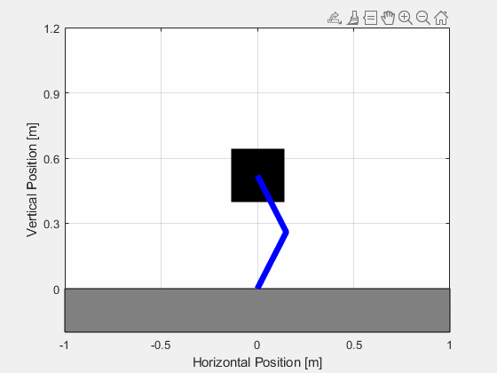

# Modeling and Control of a Vertical Hopping Robot
This project was my (Bradley Kwan) Master's thesis at California Polytechnic State University - San Luis Obispo. 
The goal of the thesis is to develop an accurate model of a vertical hopping robot within Simulink, allowing for controller development and comparison to a physical prototype.

## MATLAB Files
The following MATLAB files are used to run the Stateflow and Simscape simulations.

- **HopRobot_Stateflow.mlx**: MATLAB live script used to simulate the Stateflow Simulink model. 
- **HR_Simscape_for_Stateflow.mlx**: MATLAB live script used to simulate the Simscape model which generates the simulation data used to compare against the Stateflow model.
- **HR_Simscape_CAD.mlx**: MATLAB live script used to simulate the Simscape model which is modeled after the physical prototype of the hopping robot. Position control is implemented during flight, and impedance control is implemented during stance.

## Simulink Files
The following Simulink files model the dynamics of the hopping robot constrained to a vertical slider.

- **HR_Stateflow_Control.slx**: Stateflow model of hopping robot
- **Simscape_for_Stateflow.slx**: Simscape model of hopping robot that uses thin solid models and point masses to mimic the Stateflow model.
- **Simscape_CAD.slx**: Simscape model of hopping robot that uses the STEP files from the CAD for the physical prototype of the hopping robot. 